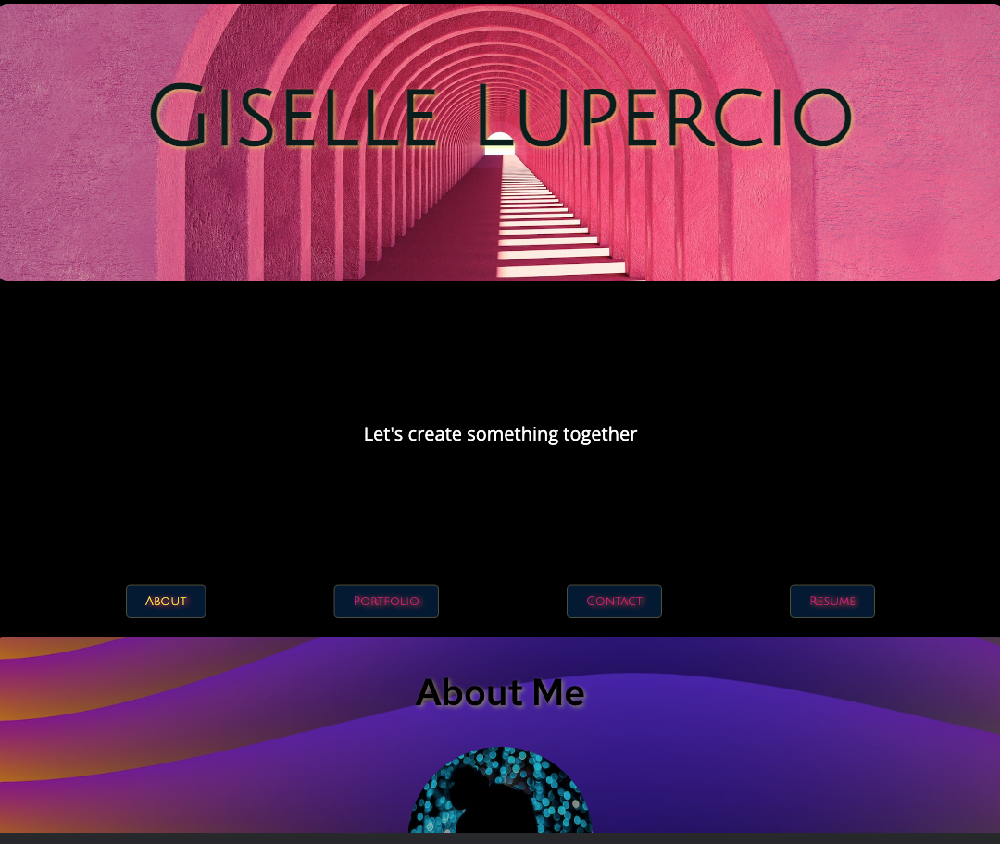
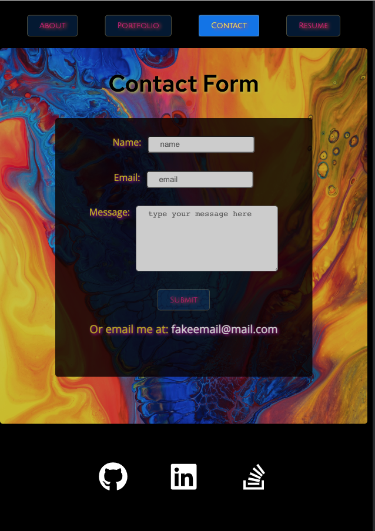
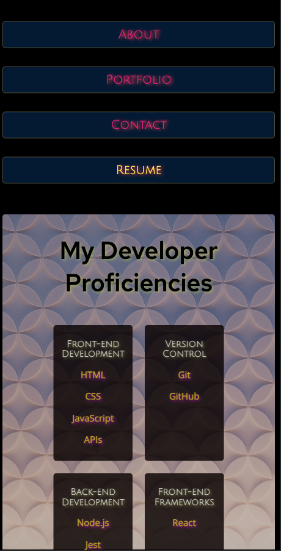

# c-20-React-Portfolio

## Description

I built this portfolio to practice using React and to showcase applications I have worked on and have contributed to. This application includes a short biography, links to my deployed projects and their respective repos, a form that will one day allow people to directly message me and a fake email that will soon be replaced with my actual email, and a list of my developer proficiencies as well as a link to download a fake resume which will soon be replaced with my real resume. At the bottom of my application, my footer includes three icons that are links to my GitHub profile, LinkedIn profile, and Stack Overflow Profile. This project was styled exclusively using CSS.

## Table of Contents

- [Installation](#installation)
- [Usage](#usage)
- [Credits](#credits)
- [License](#license)

## Installation

 Click on the link to view the deployed application.

### Deployed Application:  
[My Portfolio](https://perfectblue0.github.io/c-20-React-Portfolio/)
### Repo:
[View My Repo](https://github.com/perfectblue0/c-20-React-Portfolio)

## Usage

Below you'll find images of my portfolio that was built with React. Clicck on the navigation buttons to render different information.  

  

Coming Soon: send me a direct message or send me an email.  

  

This is what my application would look like on a mobile screen.  

   
## Credits

To create this application I used code from class activities that was shared with students in the UC Berkeley Full-Stack Bootcamp class as well as had help from Francisco Rivera, a TA, and Samantha Randolph, my instructor. 

## License

Please refer to the repo.
